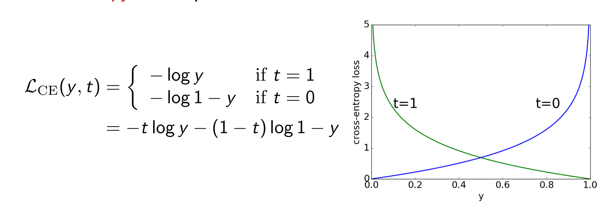
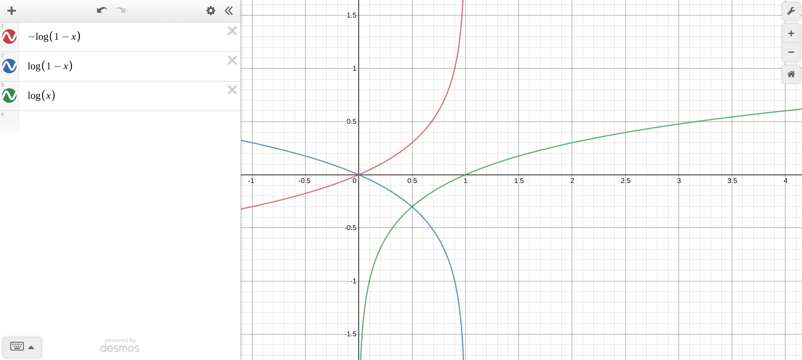

## Basic understanding

1. What is a distribution in statistics?

- A data distribution is a function or a listing which shows all the possible values (or intervals) of the data. It also (and this is important) tells you how often each value occurs. Often, the data in a distribution will be ordered from smallest to largest, and graphs and charts allow you to easily see both the values and the frequency with which they appear.

2. Parametric modelling

- In probability theory and statistics, a probability distribution is a mathematical function that provides the probabilities of occurrence of different possible outcomes in an experiment. In more technical terms, the probability distribution is a description of a random phenomenon in terms of the probabilities of events. For instance, if the random variable X is used to denote the outcome of a coin toss ("the experiment"), then the probability distribution of X would take the value 0.5 for X = heads, and 0.5 for X = tails (assuming the coin is fair)
- A parametric model is a family of probability distributions that has a finite number of parameters

3. Sample Space

The sample space is the complete set of all values an observation x can take

4. Probability Density Function (or simply density function)

5. Joint probability and conditional probability

## GAN

### GAN Loss

#### Discriminator

The discriminator is a binary classifier to distinguish if the input 𝑥 is real (from real data) or fake (from the generator). Typically, the discriminator outputs a scalar prediction 𝑜 ∈ ℝ  for input 𝐱, such as using a dense layer with hidden size 1, and then applies sigmoid function to obtain the predicted probability 𝐷(𝐱) = 1 / (1+𝑒−𝑜) . Assume the label 𝑦 for true data is 1 and 0 for fake data. We train the discriminator to minimize the cross entropy loss

          min −𝑦log𝐷(𝐱) − (1−𝑦)log(1−𝐷(𝐱))

#### Generator

For the generator, it first draws some parameter 𝐳 ∈ ℝ𝑑 from a source of randomness, e.g. a normal distribution 𝐳∼(0,1). We often call 𝐳 the latent variable. It then applies a function to generate 𝐱′ = 𝐺(𝐳). The goal of the generator is to fool the discriminator to classify 𝐱′ as true data. In other words, we update the parameters of the generator to maximize the cross entropy loss when 𝑦 = 0

          max −log(1−𝐷(𝐱′))

As shown in the graph, maximizing -log(1−𝐷(𝐱′)) is equivalent to minimizing log(1−𝐷(𝐱′)). And minimizing log(1−𝐷(𝐱′)) is equivalent to maximizing log(𝐷(𝐱′)). So commonly we minimize the following loss

          max log(𝐷(𝐱′))
 
which is just feed  𝐱′  into the discriminator but giving label  𝑦=1 

### Debugging
- Mode collapse: https://machinelearningmastery.com/practical-guide-to-gan-failure-modes/
- https://arxiv.org/pdf/1701.04862.pdf
- https://arxiv.org/pdf/1606.03498.pdf
- https://sebastianraschka.com/pdf/lecture-notes/stat479ss19/L17_gan_slides.pdf

### Tricks

- Gradient accumulation: https://medium.com/huggingface/training-larger-batches-practical-tips-on-1-gpu-multi-gpu-distributed-setups-ec88c3e51255
- Strided convolution versus pooling: https://stats.stackexchange.com/questions/387482/pooling-vs-stride-for-downsampling
- Transposed convolution: https://medium.com/activating-robotic-minds/up-sampling-with-transposed-convolution-9ae4f2df52d0

### GAN architectures

- https://machinelearningmastery.com/a-gentle-introduction-to-the-biggan/

## Reference
1. https://www.statisticshowto.datasciencecentral.com/data-distribution/
